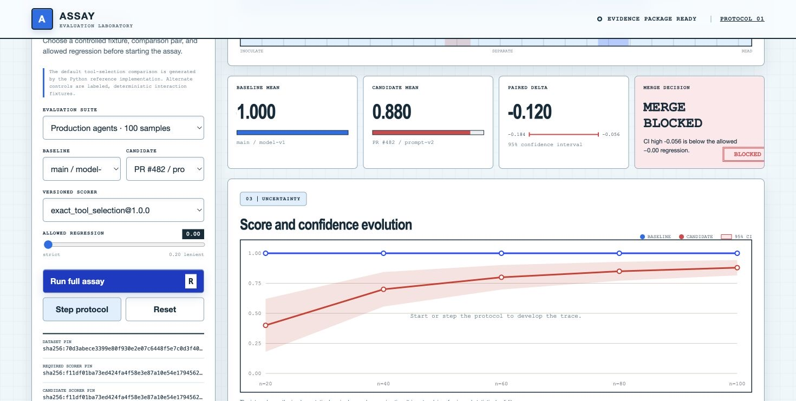

# ASSAY

ASSAY is a deterministic evaluation harness for language-model samples and
world-model rollouts. Both use one content-addressed sample and scorer
contract, one per-sample comparison engine, and one CI gate.

The [product site](https://aneesh-pothuru.github.io/assay/) explains the thesis,
evidence, method, architecture, and honest limits. Its
[interactive evaluation bench](https://aneesh-pothuru.github.io/assay/demo/)
lets reviewers run or step a deterministic comparison, adjust the gate,
inspect paired sample diffs, and export the evidence.

The build brief is copied to [`docs/BRIEF.md`](docs/BRIEF.md). This repository
implements the P0 contract with standard-library Python. It deliberately does
not claim public-checkpoint or provider measurements; see
[`LIMITS.md`](LIMITS.md).

## Journey 0

```bash
git clone https://github.com/Aneesh-Pothuru/assay
cd assay
make demo
```

The demo needs no API key or network. It compares two bundled 100-sample runs,
finds the twelve seeded regressions, computes a paired confidence interval,
writes [`docs/demo/index.html`](docs/demo/index.html), and observes the required
`BLOCKED` gate. The `assay demo` command itself exits `1`; `make demo` treats
that expected gate result as success.



After installation, the brief's command also works:

```bash
python -m pip install .
assay demo                 # expected exit code: 1
assay demo --gate-in-ci
```

## Commands

```bash
make test
make lint
make reproduce-seeded-regression
make reproduce-wm
```

`make reproduce-wm` executes four scorer contracts on a tiny deterministic
gridworld fixture: drift-over-horizon, action grounding, memory through
occlusion, and in-model to out-of-model utility. These are contract/reference
tests, not measurements on public checkpoints.

## Architecture

```text
versioned samples ──> Run records ──> versioned scorer
       │                                   │
       └──────── comparison + CI <─────────┘
                         │
                 structured gate
                         │
                  JSON + static HTML
```

Datasets and scorers are content-addressed. A run pins both hashes, unversioned
dataset payloads are rejected, and cross-scorer-version comparisons raise a
hard error. The vendored `loopkit` subset is in
`src/assay/schemas/loopkit.py`.

## Product UX

- [`docs/USER_JOURNEYS.md`](docs/USER_JOURNEYS.md) maps success, failure, and
  undetermined paths for ML engineers, reviewers, eval authors, and
  governance/infrastructure operators.
- [`docs/COMPETITIVE_UI.md`](docs/COMPETITIVE_UI.md) documents the primary-source
  product research and the distinctive clinical assay-bench direction.
- The GitHub Pages demo uses deterministic embedded fixtures. Extra candidate,
  suite, scorer, and tolerance states demonstrate the workflow; they are not
  presented as external model measurements.
